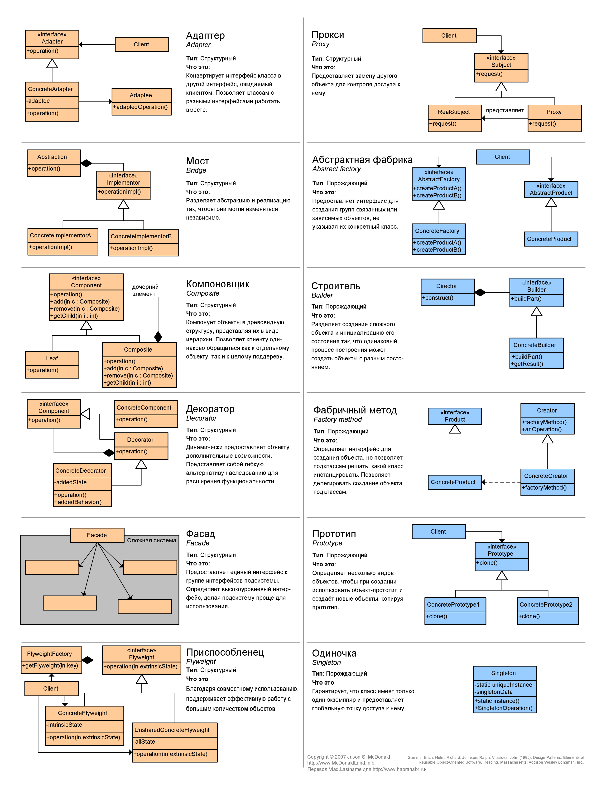
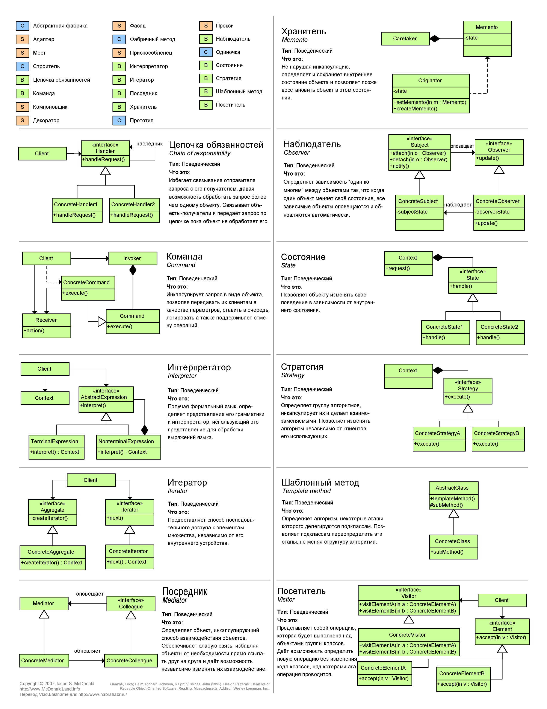

#Design Patterns

* [github.com/Home-Java8/all_patterns/tree/master/out/production/Lessons/com/patterns](https://github.com/Home-Java8/all_patterns/tree/master/out/production/Lessons/com/patterns) **(** [docs](https://github.com/Home-Java8/all_patterns/blob/master/out/production/Lessons/com/patterns/docs.txt) **|** [behavioral](https://github.com/Home-Java8/all_patterns/tree/master/out/production/Lessons/com/patterns/behavioral) **|** [design-patterns-visitor](https://dzone.com/articles/design-patterns-visitor) **)**

###Основные (Fundamental):
   - Делегирование (`Delegation`)
   - Интерфейс (`Interface`)
   - Абстрактный суперкласс (`Abstract Superclass`)
   - Интерфейс и абстрактный класс (`Interface and Abstract Class`)
   - Неизменный (`Immutable`)
   - Маркер-интерфейс (`Marker Interface`)
   - Заместитель (`Ргоху`)

#Виды паттернов:

###1. [Порождающие](Порождающие) ([Creational](Creational) - они создают объекты):
   - Одиночка (`Singleton`)
   - Фабричный метод (`Factory Method`)
   - Абстрактная фабрика (`Abstract Factory`)
   - Строитель (`Builder`)

###2. [Структурные](Структурные) ([Structural](Structural) - они изменяют структуру уже готового созданого объекта):
   - Декоратор (`Decorator`)
   - Адаптер (`Adapter`)
   - Фасад (`Facade`)
   - Заместитель (`Proxy`)
   - Компоновщик (`Composite`)
   - Итератор (`Iterator`)
   - Мост (`Bridge`)
   - Приспособленец (`Ayweight`)
   - Динамическая компоновка (`Dynamic Linkage`)
   - Виртуальный заместитель (`Virtual Proxy`)
   - Упрамение кэшем (`Cache Management`)

###3. [Поведенческие](Поведенческие) ([Behavioral](Behavioral)):
   - Наблюдатель (`Observer`)
   - Состояние (`State`)
   - Стратегия (`Strategy`)
   - Команда (`Command`)
   - Цепочка обязанностей (`Chain of Responsibility`)
   - Посредник (`Mediator`)
   - Нулевой объект (`Null Object`)
   - Метод шаблона (`Template Method`)
   - Посетитель (`Visitor`)

###4. Системные (System):
   - Модель-Вид-Контроллер (`MVC: Model-View-Controller`)
   - Session (`Session Facade`)
   - Worker Thread (`для улучшение пропускной способности и минимизация средней задержки при реализации параллельного выполнения`)
   - Обратный вызов (`Callback`)

