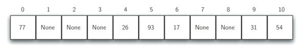
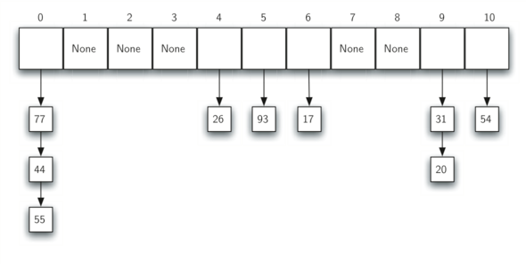

---

( [Пузырьковая сортировка](http://aliev.me/runestone/SortSearch/TheBubbleSort.html) )
[Хэширование](http://aliev.me/runestone/SortSearch/Hashing.html)
[HashMap](https://habrahabr.ru/post/128017)

[HashTables](HashTables.pdf) **(** [HashTables](https://acm.bsu.by/w/images/c/c0/HashTables.pdf) **)**

###Хэширование

Во всех `хэш-функциях` присутствует **метод остатков** — (модульная арифметика) берёт элемент делит его на размер таблицы и возвращая остаток в качестве хэш-значения:

    h(item) = item % 11

Если всё находится там где ему положено то мы получаем алгоритм поиска за константное время (по найденному индексу):

    O(1)

**Коллизия** — в соответствии с `хэш-функцией` 2-а или более элементов могут попадать в один бакет.

###Разрешение коллизий

* **Идеальная хэш-функция** — один из способов всегда иметь `идеальную хэш-функцию` состоит в увеличении размера `хэш-таблицы` чтобы каждое из возможных значений элементов имело уникальное размещение (таким образом гарантируется уникальность бакетов).

* Разрешение коллизий с помощью `цепочек` — `цепочки` позволяют множеству элементов занимать одну и ту же позицию в хэш-таблице:

###HashMap

* `table` — Массив типа Entry[], который является хранилищем ссылок на списки (цепочки) значений

* `loadFactor` — Коэффициент загрузки. Значение по умолчанию 0.75 является хорошим компромиссом между временем доступа и объемом хранимых данных

* threshold — Предельное количество элементов, при достижении которого, размер хэш-таблицы увеличивается вдвое. Рассчитывается по формуле `(capacity * loadFactor)`

* `size` — Количество элементов HashMap-а

* Добавление элемента

* Resize и Transfer

    Когда массив table[] заполняется до предельного значения, его размер увеличивается вдвое и происходит перераспределение элементов.
    
    Метод transfer() перебирает все элементы текущего хранилища, пересчитывает их индексы (с учетом нового размера) и перераспределяет элементы по новому массиву.

* Удаление элементов

    У HashMap есть такая же проблема как и у ArrayList — при удалении элементов размер массива table[] не уменьшается.

    ( И если в ArrayList предусмотрен метод trimToSize(), то в HashMap таких методов нет )

---

