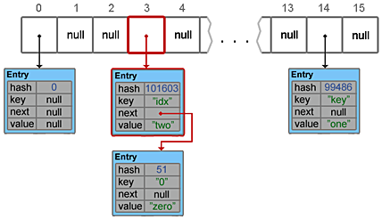
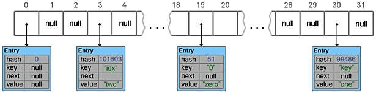

---

( [Пузырьковая сортировка](http://aliev.me/runestone/SortSearch/TheBubbleSort.html) )
[Хэширование](http://aliev.me/runestone/SortSearch/Hashing.html)
[HashMap](https://habrahabr.ru/post/128017)

[HashTables](HashTables.pdf) **(** [HashTables](https://acm.bsu.by/w/images/c/c0/HashTables.pdf) **)**


###Хэширование

Во всех `хэш-функциях` присутствует **метод остатков** — (модульная арифметика) берёт элемент делит его на размер таблицы и возвращая остаток в качестве хэш-значения:

    h(item) = item % 11


Если всё находится там где ему положено то мы получаем алгоритм поиска за константное время (по найденному индексу):

    O(1)

**Коллизия** — в соответствии с `хэш-функцией` 2-а или более элементов могут попадать в один бакет.

###Разрешение коллизий

* **Идеальная хэш-функция** — один из способов всегда иметь `идеальную хэш-функцию` состоит в увеличении размера `хэш-таблицы` чтобы каждое из возможных значений элементов имело уникальное размещение (таким образом гарантируется уникальность бакетов).

* Разрешение коллизий с помощью `цепочек` — `цепочки` позволяют множеству элементов занимать одну и ту же позицию в хэш-таблице:


###HashMap

* `table` — Массив типа Entry[], который является хранилищем ссылок на списки (цепочки) значений

* `loadFactor` — Коэффициент загрузки. Значение по умолчанию 0.75 является хорошим компромиссом между временем доступа и объемом хранимых данных

* threshold — Предельное количество элементов, при достижении которого, размер хэш-таблицы увеличивается вдвое. Рассчитывается по формуле `(capacity * loadFactor)`

* `size` — Количество элементов HashMap-а

* Добавление элемента



* Resize и Transfer

    Когда массив table[] заполняется до предельного значения, его размер увеличивается вдвое и происходит перераспределение элементов.
    
    Метод transfer() перебирает все элементы текущего хранилища, пересчитывает их индексы (с учетом нового размера) и перераспределяет элементы по новому массиву.



* Удаление элементов

    У HashMap есть такая же проблема как и у ArrayList — при удалении элементов размер массива table[] не уменьшается.

    ( И если в ArrayList предусмотрен метод trimToSize(), то в HashMap таких методов нет )


---

```javascript
    /**
     * java.util.concurrent
     */
    Executors.newFixedThreadPool(10);    // вернет исполнителя с пулом в 10-потоков
    Executors.newWorkStealingPool();     // вернет исполнителя с пулом потоков равным количеству ядер машины
```

    Основное преимущество исполнителей-тредов в том что они создают пулы потоков — то есть, при освобождении поток НЕпрекращает свою работу, а освобождает и держит свой рессурс для других вызовов


---

[Stream API](https://metanit.com/java/tutorial/10.1.php)
[Что же такое сплитератор](https://habrahabr.ru/post/256905)
**(** [Что же такое сплитератор](http://info.javarush.ru/translation/2014/05/30/Параллельные-операции-над-массивами-в-Java-8-перевод.html) **)**
[Обратный порядок потока Java 8](http://qaru.site/questions/63455/java-8-stream-reverse-order)

[Основы одновременного исполнения в Java 8](https://www.ibm.com/developerworks/ru/library/j-jvmc2/index.html) **(** [Часть 1](https://www.ibm.com/developerworks/library/j-jvmc1/index.html) **)**


###Stream

* `Потоки` — это push-итераторы (обработчики) и используются совместно с `лямбда-выражениями`


    Отличие потоков от коллекций:
    
    1. Потоки не хранят элементов. Элементы используемые в потоках могут храниться в коллекции, либо могут быть напрямую сгенерированы
    
    2. Операции с потоками не изменяют источника данных. Операции с потоками только возвращают новый поток с результатами этих операций
    
    3. Для потоков характерно отложенное выполнение. То есть выполнение всех операций с потоком происходит лишь тогда, когда выполняется терминальная операция и возвращается конкретный результат, а не новый поток

* Вся основная функциональность Stream API сосредоточена в пакете `java.util.stream`


    В основе Stream API лежит интерфейс 'BaseStream'

```javascript
    interface BaseStream<T, S extends BaseStream<T, S>>
```


**(** находятся в пакете `java.util.concurrent` **)**

* `Future` — (в Java 8) поддерживает 2-а способа использования: 
1. можно либо проверять не завершился ли future-объект
2. либо ждать завершения future-объекта

* `CompletionStage` — представляет этап или шаг в асинхронном вычислении (определяет множество способов для связывания экземпляров `CompletionStage` в цепочку с другими экземплярами или кодом...)

* В Java 8 добавлен класс `CompletableFuture` — он упрощает работу для **асинхронных операций** (параллельных вычислений)
* * `CompletableFuture<T>` — реализует интерфейс `CompletionStage<T>` и расширяет интерфейс `Future<T>`
* * Метод `supplyAsync()` — принимает экземпляр `Supplier<T>`
* * Метод `join()` — ждет доступности результата от каждого future-объекта

```javascript
    /**
     * (функциональный интерфейс с методом, возвращающий значение типа T) и возвращает экземпляр CompletableFuture<T>
     * а также помещает Supplier в очередь для исполнения в асинхронном режиме
     */
    CompletableFuture<DistancePair> future = CompletableFuture.supplyAsync(() -> checker.bestDistance(target));
    future.join();
```

```javascript
    private final List<ChunkDistanceChecker> chunkCheckers;
    ...

    /**
     * Класс CompletableFuture с использованием потоков
     */
    public DistancePair bestMatch(String target) {
        return chunkCheckers.stream() //создает поток
            .map(checker -> CompletableFuture.supplyAsync(() -> checker.bestDistance(target))) //применяет отображение к значениям в потоке с целью создания CompletableFuture для результата асинхронного исполнения метода
            .collect(Collectors.toList()) //собирает значения в список
            .stream() //возвращает обратно в поток
            .map(future -> future.join()) //ждет доступности результата каждого future
            .reduce(DistancePair.worstMatch(), (a, b) -> DistancePair.best(a, b)); //терминальная операция - асинхронное исполнения метода ChunkDistanceChecker.bestDistance()
    }

    /**
     * (Параллельные потоки) более удобный способ реализации параллельных операций с потоками, чем громоздкий подход
     */
    public DistancePair bestMatch(String target) {
        return chunkCheckers.parallelStream()
            .map(checker -> checker.bestDistance(target))
            .reduce(DistancePair.worstMatch(), (a, b) -> DistancePair.best(a, b));
    }
```

###Spliterator ( находятся в пакете `java.util.concurrent` )

    Spliterator — это интерфейс (похож на обычный Iterator) используется В ПОТОКАХ для итерации, разделения массива и коллекций (Collection)
    
    Основное отличие сплитератора — это умение разделиться (split) на две части — это и лежит в основе работы параллельных потоков

    ( Когда сплитератор писать не надо — главное понимать что сам по себе сплитератор не нужен, а нужен поток... )

```javascript
    java.util.Spliterator<T> spliterator(); //возвращает ссылку на сплитератор потока
    
    /**
     * Создать поток по имеющемуся сплитератору
     */
    StreamSupport.stream()...;
```

Из `Spliterator` используются методы: `tryAdvance()` и `forEachRemaining()` для применения действий к элементам


