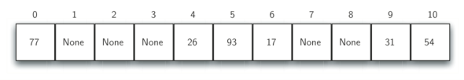
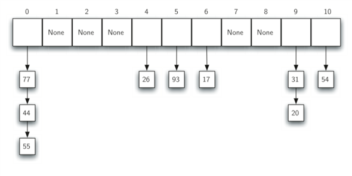
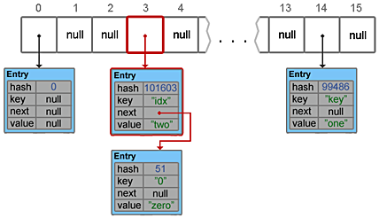
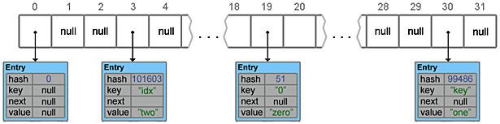
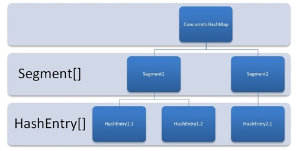
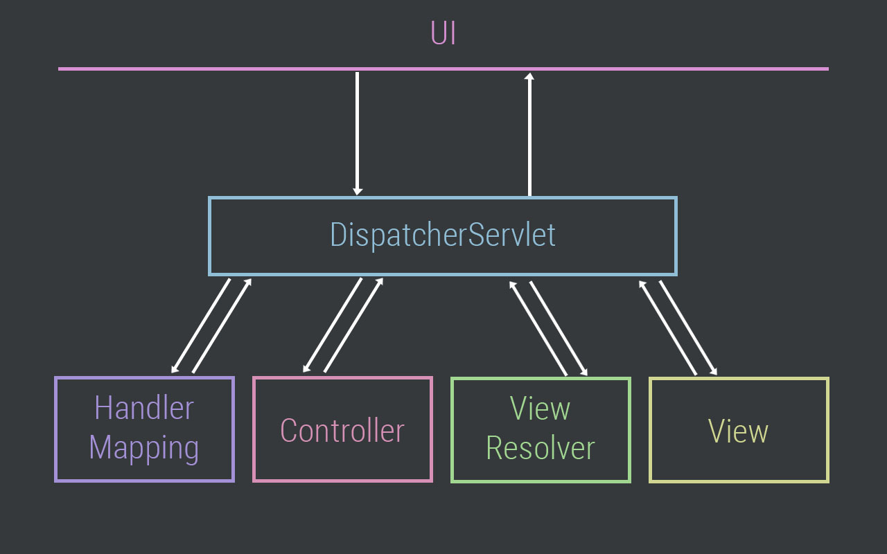

---

( [Пузырьковая сортировка](http://aliev.me/runestone/SortSearch/TheBubbleSort.html) )
[Хэширование](http://aliev.me/runestone/SortSearch/Hashing.html)
[HashMap](https://habrahabr.ru/post/128017)
[HashMap и ConcurrentHashMap популярные вопросы на собеседованиях](http://info.javarush.ru/translation/2013/09/23/HashMap-и-ConcurrentHashMap-популярные-вопросы-на-собеседованиях.html)
[Как работает ConcurrentHashMap](https://habrahabr.ru/post/132884)
[Уровень 26. Ответы на вопросы к собеседованию по теме уровня (Часть 2)](http://info.javarush.ru/zor07/2016/07/24/Уровень-26-Ответы-на-вопросы-к-собеседованию-по-теме-уровня-Часть-2-Вопросы-6-9-11-12.html)
[Пишем асинхронный код с CompletableFuture](https://kurspc.com.ua/node/424)
[Проблема использования CompletableFuture в нескольких потоках](https://habrahabr.ru/post/325730)

[HashTables](HashTables.pdf) **(** [HashTables](https://acm.bsu.by/w/images/c/c0/HashTables.pdf) **)**

[CompletableFuture](JPoint2015_Chuyko.pdf) **(** [CompletableFuture](http://2015.jpoint.ru/presentations/JPoint2015_Chuyko.pdf) **)**

###Хэширование

Во всех `хэш-функциях` присутствует **метод остатков** — (модульная арифметика) берёт элемент делит его на размер таблицы и возвращая остаток в качестве хэш-значения:

    h(item) = item % 11



Если всё находится там где ему положено то мы получаем алгоритм поиска за константное время (по найденному индексу):

    O(1)

**Коллизия** — в соответствии с `хэш-функцией` 2-а или более элементов могут попадать в один бакет.

###Разрешение коллизий

* **Идеальная хэш-функция** — один из способов всегда иметь `идеальную хэш-функцию` состоит в увеличении размера `хэш-таблицы` чтобы каждое из возможных значений элементов имело уникальное размещение (таким образом гарантируется уникальность бакетов).

* Разрешение коллизий с помощью `цепочек` — `цепочки` позволяют множеству элементов занимать одну и ту же позицию в хэш-таблице:




###HashMap

* `table` — Массив типа Entry[], который является хранилищем ссылок на списки (цепочки) значений

* `loadFactor` — Коэффициент загрузки. Значение по умолчанию 0.75 является хорошим компромиссом между временем доступа и объемом хранимых данных

* threshold — Предельное количество элементов, при достижении которого, размер хэш-таблицы увеличивается вдвое. Рассчитывается по формуле `(capacity * loadFactor)`

* `size` — Количество элементов HashMap-а

* Добавление элемента



* Resize и Transfer

    Когда массив table[] заполняется до предельного значения, его размер увеличивается вдвое и происходит перераспределение элементов.
    
    Метод transfer() перебирает все элементы текущего хранилища, пересчитывает их индексы (с учетом нового размера) и перераспределяет элементы по новому массиву.



* Удаление элементов

    У HashMap есть такая же проблема как и у ArrayList — при удалении элементов размер массива table[] не уменьшается.

    ( И если в ArrayList предусмотрен метод trimToSize(), то в HashMap таких методов нет )


###Использование HashMap в несинхронизированном коде многопоточных приложений

- влияние случайных значений для построения ключа (если положение объекта ключа меняется каждый раз то его положение будет рассчитываться каждый раз разными способами, таким образом объект хранящийся в HashMap будет потерян навсегда)
- использование HashMap в несинхронизированном коде многопоточных приложений:
  - - `концепция повторного хеширования`: когда HashMap достигает своего верхнего предела - тогда выполняется процесс создания новой области памяти и копирования туда существующих элементов.


    Во время повторного хеширования, из разных потоков, существует возможность для создания циклической зависимости где элемент находящийся в списке может указывать на любой предыдущий узел в ту же область памяти.


###СoncurrentHashMap

* **СoncurrentHashMap** — состоит из внутренних *`сегментов`*: (это группа `HashMap`-ов) один *`сегмент`* эквивалентен одному `HashMap`-у.
  `ConcurrentHashMap` разделен на множество `сегментов`, по умолчанию их 16.

Если пара *key-value* хранится в `сегменте` №10, то не нужно блокировать остальные 15-сегментов... — другими словами `ConcurrentHashMap` использует множество *замков* и каждый *замок* управляет одним `сегментом` структуры:
1. Для чтения данных — `сегмент` используется *без синхронизации*
2. Для обновления и вставки данных — `сегмент` *блокируется и запись производится в синхронизированный блок*



    ConcurrentHashMap должен применяться грамотно, с предварительной оценкой соотношения чтения и записи в карту (это ресурсоемкий элемент).
    
    Также по-прежнему имеет смысл использовать HashMap в программах, где нет множественного доступа от нескольких потоков к хранимой карте.


Основные преимущества и особенности реализации *ConcurrentHashMap*:
- имеет схожий с *HashMap интерфейс*
- *операции чтения* не требуют блокировок и выполняются параллельно
- каждый *сегмент* представляет собой *потокобезопасную таблицу* элементов карты (*операции записи* также могут выполняться параллельно...)
- при создании указывается требуемый `concurrencyLevel` (определяемый по статистике чтения и записи)
- в отличие от элементов *HashMap*, **Entry** в *ConcurrentHashMap* объявлены как `volatile` (элементы карты имеют значение *value* объявленное как `volatile`)
- В *ConcurrentHashMap* используется улучшенная *функция хэширования*
```javascript
    private static int hash(int h) {
        h += (h << 15) ^ 0xffffcd7d;
        h ^= (h >>> 10);
        h += (h << 3);
        h ^= (h >>> 6);
        h += (h << 2) + (h << 14);
        return h ^ (h >>> 16);
    }
```


|||||||||||||||||||||||||||||||||||||||||||||||||||||||||||||||||||||||||||||||||||||||||||||||||||||||||||||||||||||||||||

---

```javascript
    /**
     * java.util.concurrent
     */
    Executors.newFixedThreadPool(10);    // вернет исполнителя с пулом в 10-потоков
    Executors.newWorkStealingPool();     // вернет исполнителя с пулом потоков равным количеству ядер машины
```

    Основное преимущество исполнителей-тредов в том что они создают пулы потоков — то есть, при освобождении поток НЕпрекращает свою работу, а освобождает и держит свой рессурс для других вызовов


---

[Stream API](https://metanit.com/java/tutorial/10.1.php)
[Что же такое сплитератор](https://habrahabr.ru/post/256905)
**(** [Что же такое сплитератор](http://info.javarush.ru/translation/2014/05/30/Параллельные-операции-над-массивами-в-Java-8-перевод.html) **)**
[Обратный порядок потока Java 8](http://qaru.site/questions/63455/java-8-stream-reverse-order)

[Основы одновременного исполнения в Java 8](https://www.ibm.com/developerworks/ru/library/j-jvmc2/index.html) **(** [Часть 1](https://www.ibm.com/developerworks/library/j-jvmc1/index.html) **)**

[Spliterator](http://spec-zone.ru/RU/Java/Docs/8/api/java/util/Spliterator.html)

###Stream

* `Потоки` — это push-итераторы (обработчики) и используются совместно с `лямбда-выражениями`


    Отличие потоков от коллекций:
    
    1. Потоки не хранят элементов. Элементы используемые в потоках могут храниться в коллекции, либо могут быть напрямую сгенерированы
    
    2. Операции с потоками не изменяют источника данных. Операции с потоками только возвращают новый поток с результатами этих операций
    
    3. Для потоков характерно отложенное выполнение. То есть выполнение всех операций с потоком происходит лишь тогда, когда выполняется терминальная операция и возвращается конкретный результат, а не новый поток

* Вся основная функциональность Stream API сосредоточена в пакете `java.util.stream`


    В основе Stream API лежит интерфейс 'BaseStream'

```javascript
    interface BaseStream<T, S extends BaseStream<T, S>>
```


**(** находятся в пакете `java.util.concurrent` **)**

* `Future` — (в Java 8) поддерживает 2-а способа использования: 
1. можно либо проверять не завершился ли future-объект
2. либо ждать завершения future-объекта

* `CompletionStage` — представляет этап или шаг в асинхронном вычислении (определяет множество способов для связывания экземпляров `CompletionStage` в цепочку с другими экземплярами или кодом...)

* В Java 8 добавлен класс `CompletableFuture` — он упрощает работу для **асинхронных операций** (параллельных вычислений)
* * `CompletableFuture<T>` — реализует интерфейс `CompletionStage<T>` и расширяет интерфейс `Future<T>`
* * Метод `supplyAsync()` — принимает экземпляр `Supplier<T>`
* * Метод `join()` — ждет доступности результата от каждого future-объекта

```javascript
    /**
     * (функциональный интерфейс с методом, возвращающий значение типа T) и возвращает экземпляр CompletableFuture<T>
     * а также помещает Supplier в очередь для исполнения в асинхронном режиме
     */
    CompletableFuture<DistancePair> future = CompletableFuture.supplyAsync(() -> checker.bestDistance(target));
    future.join();
```

```javascript
    private final List<ChunkDistanceChecker> chunkCheckers;
    ...

    /**
     * Класс CompletableFuture с использованием потоков
     */
    public DistancePair bestMatch(String target) {
        return chunkCheckers.stream() //создает поток
            .map(checker -> CompletableFuture.supplyAsync(() -> checker.bestDistance(target))) //применяет отображение к значениям в потоке с целью создания CompletableFuture для результата асинхронного исполнения метода
            .collect(Collectors.toList()) //собирает значения в список
            .stream() //возвращает обратно в поток
            .map(future -> future.join()) //ждет доступности результата каждого future
            .reduce(DistancePair.worstMatch(), (a, b) -> DistancePair.best(a, b)); //терминальная операция - асинхронное исполнения метода ChunkDistanceChecker.bestDistance()
    }

    /**
     * (Параллельные потоки) более удобный способ реализации параллельных операций с потоками, чем громоздкий подход
     */
    public DistancePair bestMatch(String target) {
        return chunkCheckers.parallelStream()
            .map(checker -> checker.bestDistance(target))
            .reduce(DistancePair.worstMatch(), (a, b) -> DistancePair.best(a, b));
    }
```

###Spliterator ( находятся в пакете `java.util.concurrent` )

    Spliterator — это интерфейс (похож на обычный Iterator) используется В ПОТОКАХ для итерации, разделения массива и коллекций (Collection)
    
    Основное отличие сплитератора — это умение разделиться (split) на две части — это и лежит в основе работы параллельных потоков

    ( Когда сплитератор писать не надо — главное понимать что сам по себе сплитератор не нужен, а нужен поток... )

```javascript
    java.util.Spliterator<T> spliterator(); //возвращает ссылку на сплитератор потока
    
    /**
     * Создать поток по имеющемуся сплитератору
     */
    StreamSupport.stream()...;
```

Из `Spliterator` используются методы: `tryAdvance()` и `forEachRemaining()` для применения действий к элементам

```javascript
    /**
     * Самый простой способ для поддержки параллельных потоков
     */
    public static <T> Stream<T> reverse(Stream<T> stream) {
        return stream
                .collect(Collector.of(
                        () -> new ArrayDeque<T>(),
                        ArrayDeque::addFirst,
                        (q1, q2) -> { q2.addAll(q1); return q2; })
                )
                .stream();
    }

    /**
     * Расширенный способ (поддерживает параллельные потоки в непрерывном режиме)
     */
    public static <T> Stream<T> reverse(Stream<T> stream) {
        Objects.requireNonNull(stream, "stream");
    
        class ReverseSpliterator implements Spliterator<T> {
            private Spliterator<T> spliterator;
            private final Deque<T> deque = new ArrayDeque<>();
    
            private ReverseSpliterator(Spliterator<T> spliterator) {
                this.spliterator = spliterator;
            }
    
            @Override
            @SuppressWarnings({"StatementWithEmptyBody"})
            public boolean tryAdvance(Consumer<? super T> action) {
                while(spliterator.tryAdvance(deque::addFirst));
                if(!deque.isEmpty()) {
                    action.accept(deque.remove());
                    return true;
                }
                return false;
            }
    
            @Override
            public Spliterator<T> trySplit() {
                // After traveling started the spliterator don't contain elements!
                Spliterator<T> prev = spliterator.trySplit();
                if(prev == null) {
                    return null;
                }
    
                Spliterator<T> me = spliterator;
                spliterator = prev;
                return new ReverseSpliterator(me);
            }
    
            @Override
            public long estimateSize() {
                return spliterator.estimateSize();
            }
    
            @Override
            public int characteristics() {
                return spliterator.characteristics();
            }
    
            @Override
            public Comparator<? super T> getComparator() {
                Comparator<? super T> comparator = spliterator.getComparator();
                return (comparator != null) ? comparator.reversed() : null;
            }
    
            @Override
            public void forEachRemaining(Consumer<? super T> action) {
                // Ensure that tryAdvance is called at least once
                if(!deque.isEmpty() || tryAdvance(action)) {
                    deque.forEach(action);
                }
            }
        }
    
        return StreamSupport.stream(new ReverseSpliterator(stream.spliterator()), stream.isParallel());
    }
```


---

[spring-2017](spring-diving-jpoint-2017.pdf)

[Ответы на вопросы на собеседование Spring Framework (часть 1)](https://jsehelper.blogspot.com/2016/02/spring-framework-1.html)


###DispatcherServlet

* `DispatcherServlet`: `Handler Mapping` > `Controller` > `Message Converter` (`View Resolver`)




###Spring @PostConstruct and @PreDestroy

Есть `Spring Core` и `Spring MVC`.

По умолчанию Spring создает бин со `скоупом-Singleton`.

Все скоупы, кроме `скоуп-Prototype` могут использовать call-back-методы жизненного цикла Sprina `@PostConstruct` и `@PreDestroy`
`Скоуп-Prototype` реализован на базе паттерна **Prototype Pattern** (который НЕсоздает классы-бинов, а просто копирует их состояние полей...) — и в `скоуп-Prototype` НЕпредусмотрена поддержка метода `@PreDestroy`

Чтобы использовать все скоупы из `Spring MVC` в `Spring Core` — для этого нужно указать `proxyMethod`, чтобы делегировать права вызова на уровень другого скоупа... 


<div>
    <span>Spring Framework использует множество шаблонов проектирования, например:</span><span style="font-family: &quot;arial&quot; , &quot;helvetica&quot; , sans-serif;">&nbsp;</span><br>
    <ul>
        <li><span style="font-family: &quot;arial&quot; , &quot;helvetica&quot; , sans-serif;">Singleton Pattern: Creating beans with default scope.</span></li>
        <li><span style="font-family: &quot;arial&quot; , &quot;helvetica&quot; , sans-serif;">Factory Pattern: Bean Factory classes</span></li>
        <li><span style="font-family: &quot;arial&quot; , &quot;helvetica&quot; , sans-serif;">Prototype Pattern: Bean scopes</span></li>
        <li><span style="font-family: &quot;arial&quot; , &quot;helvetica&quot; , sans-serif;">Adapter Pattern: Spring Web and Spring MVC</span></li>
        <li><span style="font-family: &quot;arial&quot; , &quot;helvetica&quot; , sans-serif;">Proxy Pattern: Spring Aspect Oriented Programming support</span></li>
        <li><span style="font-family: &quot;arial&quot; , &quot;helvetica&quot; , sans-serif;">Template Method Pattern: JdbcTemplate, HibernateTemplate etc</span></li>
        <li><span style="font-family: &quot;arial&quot; , &quot;helvetica&quot; , sans-serif;">Front Controller: Spring MVC DispatcherServlet</span></li>
        <li><span style="font-family: &quot;arial&quot; , &quot;helvetica&quot; , sans-serif;">Data Access Object: Spring DAO support</span></li>
        <li><span style="font-family: &quot;arial&quot; , &quot;helvetica&quot; , sans-serif;">Dependency Injection and Aspect Oriented Programming</span></li>
    </ul>
</div>


###Spring @Transaction

    Дело в том что все бины которые помечены Spring-овыми аннотациями БУДУТ РАБОТАТЬ ТОЛЬКО ПРИ ВЫЗОВЕ В КЛАССАХ ВЕРХНЕГО УРОВНЯ этих бинов

Это происходит потому-что Spring внутри себя использует `механизм-Proxy` который позволяет инжектить и делегировать вызовы бинов (НЕ в самом классе где компонент описывается, a) в классах верхнего уровня где эти бины объявляются в качестве полей...
(то есть, на момент когда Spring-овый `BeanFactory` создает бин, он сначала создает компоненты и только потом эти компоненты будут включены в другие классы...)
Поэтому, в случае когда над методом поставить аннотацию `@Transaction` и попытаться вызвать этот метод внутри этого-же класса через другой его метод — тогда вызова здесь НЕбудет, потому-что НЕотработает Proxy...


