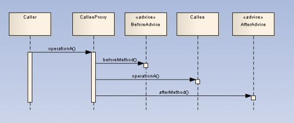

* [Знакомство с АОП](https://habrahabr.ru/post/114649/)
* [Spring АОП](http://www.finecosoft.ru/spring-aop)
* [Аспектно-ориентированное программирование в Spring Framework](http://www.quizful.net/post/aspect-oriented-programming-in-spring)


- **Аспектно-Ориентированном Программирование (АОП)** - для выделения некоторой общей функциональности - такую функциональность называют `сквозной` или `разбросанной`, потому что её реализация разбросана по разным частям приложения...

`АОП` состоит из:
1. Аспект (`Aspect`) - это набор интерфейсов которые обеспечивают сквозную функциональность
2. Совет (`Advice`) - это те действия (набор действий) которые должны быть выполнены до / после вызова метода (существует 5-типов советов)
3. Точка среза (`Pointcut`) - это набор точек (`Join points`) в которых должен быть вызван `совет`
4. Точка (`Join point`) - это место в приложении где начинается действие модуля `АОП` (где подключается `аспект`)

( Аспект - это класс, методы в нем называются советами или advices. Они делятся на 5 типов )

| Название совета   | Описание                                 |
| ----------------- | ---------------------------------------- |
| `Before`          | выполняется до вызова метода             |
|                   |                                          |
| `After`           | выполняется после вызова метода          |
|                   |                                          |
| `After returning` | выполняется после возвращения результата |
|                   |                                          |
| `After throws`    | выполняется после выброса исключения     |
|                   |                                          |
| `Around`          | объединение несколько советов в 1        |
|                   |                                          |
| `Introduction`    | специальный тип совета...                |
|                   |                                          |

    АОП - мощный инструмент в руках разработчика, который позволяет вынести сквозной функционал "за сцену" нашего приложения.
    А Spring AOP  делает это максимально удобно и понятно.


Примерами сквозной функциональности, как мы уже видели выше, могут служить:

    логирование,
    обработка транзакций,
    обработка ошибок,
    авторизация и проверка прав,
    кэширование,
    элементы контрактного программирования.

---
Например, web-сервис (сферическая служба в вакууме):

```javascript
    public BookDTO getBook(Integer bookId) {
      BookDTO book = bookDAO.readBook(bookId);
      return book;
    }
```

Метод довольно прост, но давайте подумаем чего тут не хватает:
- Первым делом нам стоит задуматься о логировании – без него, как вы сами понимаете, в web-службе никуда
- Далее необходимо реализовать обработку исключений (сделать так, что бы слой служб возвращал соответствующие ему исключения, скрывая исключения нижележащих слоёв)
- Так же не стоит забывать о проверке прав доступа
- Кроме того имеет смысл кешировать результат работы

```javascript
    public BookDTO getBook(Integer bookId) throws ServiceException, AuthException {
      if (!SecurityContext.getUser().hasRight("GetBook"))
        throw new AuthException("Permission Denied");

      LOG.debug("Call method getBook with id " + bookId);
      BookDTO book = null;
      String cacheKey = "getBook:" + bookId;

      try {
        if (cache.contains(cacheKey)) {
          book = (BookDTO) cache.get(cacheKey);
        } else {
          book = bookDAO.readBook(bookId);
          cache.put(cacheKey, book);
        }
      } catch(SQLException e) {
        throw new ServiceException(e);
      }

      LOG.debug("Book info is: " + book.toString());
      return book;
    }
```

В ходе наших доработок мы получили метод в 10 раз превышающий исходный размер, но объём бизнес-логики в нём не изменился (всё та же 1 строка).
Остальной код реализует некоторую общую служебную функциональность приложения...

---
Пример использования (AspectJ):

```javascript
    @Aspect
    public class WebServiceLogger {
      private final static Logger LOG =
        Logger.getLogger(WebServiceLogger.class);

      @Pointcut("execution(* example.WebService.*(..))")
      public void webServiceMethod() { }

      @Pointcut("@annotation(example.Loggable)")
      public void loggableMethod() { }

      @Around("webServiceMethod() && loggableMethod()")
      public Object logWebServiceCall(ProceedingJoinPoint thisJoinPoint) {
        String methodName = thisJoinPoint.getSignature().getName();
        Object[] methodArgs = thisJoinPoint.getArgs();

        LOG.debug("Call method " + methodName + " with args " + methodArgs);

        Object result = thisJoinPoint.proceed();

        LOG.debug("Method " + methodName + " returns " + result);

        return result;
      }
    }
```

    Первым делом создаётся аспект логирования методов сервисов – класс WebServiceLogger, помеченный аннотацией Aspect.
    Далее определяются два среза точек соединения: webServiceMethod (вызов метода, принадлежащего классу WebService) и loggableMethod (вызов метода, помеченного аннотацией @Loggable).
    В завершении объявляется совет (метод logWebServiceCall), который выполняется вместо (аннотация Around) точек соединения, удовлетворяющих срезу («webServiceMethod() && loggableMethod()).


- **Архитектура Spring АОП** - реализация аспектно-ориентированного программирования в Spring основана на использовании объектов-посредников (proxy).

Создание посредников возможно программным образом, используя класс [ProxyFactory](ProxyFactory) ( [ProxyFactoryBean](ProxyFactoryBean) )

* [proselyte.net/tutorials/spring-tutorial-full-version/aop-with-spring](http://proselyte.net/tutorials/spring-tutorial-full-version/aop-with-spring/) **(** [AopAnnotationsDeveloper](http://proselyte.net/tutorials/spring-tutorial-full-version/aop-with-spring/aop-example-annotations/) **|** [AopDeveloperXML](http://proselyte.net/tutorials/spring-tutorial-full-version/aop-with-spring/aop-example-xml/) **)**

Смысл АОП заключается в том что бизнес-логика приложения разбивается не на объекты, а на `отношения` (concerns).
Функции которые охватывают несколько точек приложения называются `сквозной (комплексной) проблемой` (cross-cutting concerns) и они отделены от самой бизнес-логики приложения.
(Ключевой единицей в ООП является `объект`, а ключевой единицей в АОП – `аспект`)
(В качестве примера `аспекта` можно привести: безопасность, кэширование, логирование и т.д.)
(Внедрений зависимостей DI позволяет нам отделять объекты приложения друг от друга. АОП позволяет нам отделять сквозные проблемы (cross-cuttings) от объектов)

Модуль AOP в Spring обеспечивает нас такими сущностями, как:

* `Аспект (Aspect)` Это модуль, который имеет набор программных интерфейсов, которые обеспечивают сквозные требования.
* `Срез точек (Pointcut)` Срезом называется несколько объединённых точек (join points), в котором должен быть выполнен совет.
* `Совет (Advice)` Это фактическое действие, которое должно быть предпринято до и/или после выполнения метода (существует 5-типов советов).
* `Объединённая точка (Join point)` Это такая точка в приложении, где мы можем подключить аспект. (другими словами, это место, где начинаются определённые действия модуля АОП в Spring).
* `Введение (Introduction)` Это сущность, которая помогает нам добавлять новые атрибуты и/или методы в уже существующие классы.
* `Целевой объект (Target object)` Это объект на который направлены один или несколько аспектов.
* `Плетение (Weaving)` Это процесс связывания аспектов с другими объектами приложения для создания совета (может быть вызван во время компиляции, загрузки или выполнения приложения).

---


Пример, предположим обычный вариант взаимодействия двух объектов, когда объект класса Caller вызывает метод operationA объекта класса Callee:

```javascript
    public class Caller {
          private Callee callee;

          public void someMethod() {
                callee.operationA();
          }
    }
```





Аспект - это класс, методы в нем называются советами или advices. Они делятся на 5 типов:

| Название совета   | Интерфейс                                          | Описание                                                                                                                    |
| ----------------- | -------------------------------------------------- | --------------------------------------------------------------------------------------------------------------------------- |
| `Before`          | [MethodBeforeAdvice](MethodBeforeAdvice)           | до выполнения метода |
|                   |                                                    | Этот тип совета предоставляет возможность выполнить дополнительные действия перед вызовом метода, определенного для точки соединения. Класс, реализующий before advice, имеет доступ как к целевому объекту (target), так и к аргументам метода точки соединения, однако с помощью советов данного типа невозможно отказаться от выполнения метода. |
|                   |                                                    |                                                                                                                             |
| `After`           |                                                    | после выполнения |
|                   |                                                    |                                                                                                                             |
| `After returning` | [AfterReturningAdvice](AfterReturningAdvice)       | после возвращения результата |
|                   |                                                    | AfterReturningAdvice выполняется после завершения метода, определенного для точки соединения. Этот совет доступ к целевому объекту (target), к аргументам метода точки соединения и к возвращаемому методом объекту. |
|                   |                                                    |                                                                                                                             |
| `After throws`    | [ThrowsAdvice](ThrowsAdvice)                       | после выбрасывания исключения |
|                   |                                                    | ThrowsAdvice перехватывает исключения, сгенерированные внутри метода, для которого определена точка соединения |
|                   |                                                    |                                                                                                                             |
| `Around`          | [MethodInterceptor](MethodInterceptor)             | объединение несколько советов в 1 |
|                   |                                                    | Advice, реализующий определенный Альянсом АОП интерфейс org.aopalliance.intercept.MethodInterceptor, выполняется вместо целевого метода, а сам целевой метод передается аcпекту в качестве параметера, чтобы вызвать его при необходимости в соответствующий момент. Используя Advice возможно вообще проигнорировать вызов целевой функции |
|                   |                                                    |                                                                                                                             |
| `Introduction`    | [IntroductionInterceptor](IntroductionInterceptor) | Специальный тип совета, используя который возможно который добавить новую функциональность к исходному классу. |
|                   |                                                    |                                                                                                                             |


Создадим мавеновский проект и добавим в помник следующие зависимости
```javascript
      <dependency>
          <groupId>org.springframework</groupId>
          <artifactId>spring-context</artifactId>
          <version>3.2.3.RELEASE</version>
      </dependency>
      <dependency>
          <groupId>org.springframework</groupId>
          <artifactId>spring-aop</artifactId>
          <version>3.2.3.RELEASE</version>
      </dependency>
      <dependency>
          <groupId>org.aspectj</groupId>
          <artifactId>aspectjweaver</artifactId>
          <version>1.7.3</version>
      </dependency>
      <dependency>
          <groupId>log4j</groupId>
          <artifactId>log4j</artifactId>
          <version>1.2.17</version>
      </dependency>
```

Теперь создадим интерфейс `Performer`
```javascript
    public interface Performer {
        void doSmth();
        String print();
    }
```

И заимплементим его в классе PerformerImpl
```javascript
    public class PerformerImpl implements Performer {
        @Override
        public void doSmth() {
            System.out.println(print());
        }
        @Override
        public String print(){
            return "Performer is working...";
        }
    }
```

Далее нам нужно создать класс с советами, они же advices. Назовем его `Aspect`
```javascript
    public class Aspect {
        private Logger logger;

        public void addAppender(){
            logger = Logger.getRootLogger();
            logger.setLevel(Level.INFO);
            PatternLayout layout = new PatternLayout("%d{ISO8601} [%t] %-5p %c %x - %m%n");
            logger.addAppender(new ConsoleAppender(layout));
        }
        public void before(){
            logger.info("Before method...");
        }
        public void after(){
            logger.info("After method...");
        }
        public void afterReturning(){
            logger.info("After returning...");
        }
        public void afterThrowing(){
            logger.info("After throwing...");
        }
    }
```

Теперь создадим `xml`, где будем настраивать наше спринговое приложение
```javascript
    <?xml version="1.0" encoding="UTF-8"?>
    <beans xmlns="http://www.springframework.org/schema/beans"
           xmlns:xsi="http://www.w3.org/2001/XMLSchema-instance" xmlns:aop="http://www.springframework.org/schema/aop"
           xsi:schemaLocation="http://www.springframework.org/schema/beans
           http://www.springframework.org/schema/beans/spring-beans.xsd
           http://www.springframework.org/schema/aop
           http://www.springframework.org/schema/aop/spring-aop.xsd">
        <bean id="performerBean" class="net.quizful.aop.PerformerImpl"/>
        <bean id="aspectBean" class="net.quizful.aop.Aspect" init-method="addAppender"/>
        <aop:config>
            <aop:aspect ref="aspectBean">
                <aop:pointcut id="performerPointcut" expression="execution (* net.quizful.aop.PerformerImpl.doSmth(..))"/>
                <aop:before method="before" pointcut-ref="performerPointcut"/>
                <aop:after method="after" pointcut-ref="performerPointcut"/>
            </aop:aspect>
        </aop:config>
    </beans>
```

