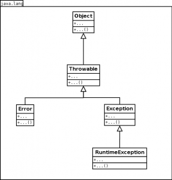
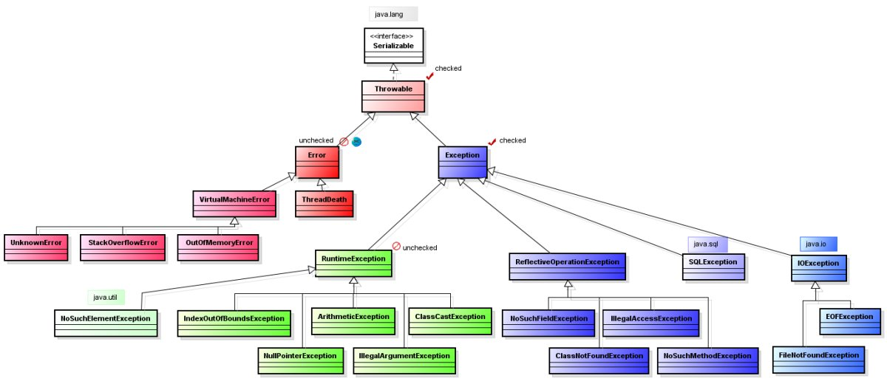

#Исключения в Java
* [quizful.net/post/java-exceptions](http://www.quizful.net/post/java-exceptions)
* [Исключения](http://developer.alexanderklimov.ru/android/java/exception.php)
* [Java finally](https://ru.stackoverflow.com/questions/350410/java-finally)
* [Обработка ошибок и исключения](https://neerc.ifmo.ru/wiki/index.php?title=%D0%9E%D0%B1%D1%80%D0%B0%D0%B1%D0%BE%D1%82%D0%BA%D0%B0_%D0%BE%D1%88%D0%B8%D0%B1%D0%BE%D0%BA_%D0%B8_%D0%B8%D1%81%D0%BA%D0%BB%D1%8E%D1%87%D0%B5%D0%BD%D0%B8%D1%8F)

######В Java есть 5-ть ключевых слов для работы с исключениями:
    (1) try — данное ключевое слово используется для отметки начала блока кода, который потенциально может привести к ошибке.
    (2) catch — ключевое слово для отметки начала блока кода, предназначенного для перехвата и обработки исключений.
    (3) finally — ключевое слово для отметки начала блока кода, которое является дополнительным. Этот блок помещается после последнего блока 'catch'. Управление обычно передаётся в блок 'finally' в любом случае (чтобы гарантировать что определенный участок кода будет выполняться независимо от того какие исключения были возбуждены и перехвачены).
    (4) throw — служит для генерации исключений.
    (5) throws — ключевое слово, которое прописывается в сигнатуре метода, и обозначающее что метод потенциально может выбросить исключение с указанным типом.

###Иерархия исключений (здесь основными классами являются Throwable, Error, Exception и RuntimeException, именно с ними связанна вся "магия")


1. **Throwable** (`проверяемое`) — все классы обрабатывающие ошибки являются наследниками этого класса (только объекты этого класса и его наследников могут быть "брошены" JVM при возникновении какой-нибудь исключительной ситуации):
2. **Error** (`НЕ проверяемое`) — (прямой наследник класса *Throwable*) показывает критические проблемы возникающие в JVM
3. **Exception** (`проверяемое`) — (прямой наследник класса *Throwable*, следует уделять основное внимание этой иерархии) Эта иерархия разделяется на 2-е ветви:
   - **RuntimeException** (`НЕ проверяемое`) — исключения типа *RuntimeException* возникают вследствие ошибок программирования.
   - *и все остальные исключения* (`проверяемое`) — являются следствием непредвиденного стечения обстоятельств (например: ошибок ввода-вывода).

######Дело в том, что в java есть 2-а типа исключений (`проверяемое` и `НЕ проверяемое`):
1. ***Checked*** — (`проверяемое` наследованные от *Exception*) это те, которые должны обрабатываться *блоком catch* или описываться в сигнатуре метода. И проверяются на этапе компиляции.
2. ***Unchecked*** — (`НЕ проверяемое` наследованные от *RuntimeException*) могут не обрабатываться и не быть описанными. Такие исключения происходят на этапе выполнения.

######Важная особенность:
    Checked исключения отличаются от Unchecked исключения в Java, тем что:
    - Unchecked исключения — (наследованные от RuntimeException и Error) происходит на этапе выполнения!
    - Checked исключения — (все остальные которые унаследованы от Exception) проверяются на этапе компиляции!
    В каких случаях нужно прописывать throws в сигнатуре метода (если не отлавливать его в методе):
    - когда Checked исключения (должны описываться в сигнатуре метода через throws или обрабатываться блоком try/catch/finally)!
    Одному блоку try может соответствовать сразу несколько блоков catch с разными классами исключений.
    Последовательность блоков catch должна идти от частного к более общему. В противном случае будет ошибка компиляции.

######Вложенные операторы try:
    Операторы `try` могут быть вложенными.
    Если вложенный оператор `try` не имеет своего обработчика `catch` для определения исключения, то идёт поиск обработчика `catch` у внешнего блока `try` и т.д.
    (Если подходящий catch не будет найден, то исключение обработает сама система)

######Код в блоке `finally` выполнится всегда:
    Код в блоке `finally` выполнится всегда вне зависимости от того будет вброшено исключение или нет.
    Даже если вы выполняете return в try-блоке, а также если исключение не будет поймано в блоке catch.
    Поэтому если нужно например закрыть поток или освободить ещё какие-то ресурсы в случае вброса исключения - нужно использовать блок `finally`.


######Блок `finally` не будет выполнен:
    Блок `finally` не будет выполнен если:
    - код до него успеет вызвать `System.exit()`
    - или произойдёт креш JVM (или процесс будет каким-либо внешним образом уничтожен)


######Цепочки исключений (позволяют узнать, какое исключение привело к появлению другого исключения)
- Throwable getCause() — возвращает исключение, которое стало причиной текущего исключения
- Throwable initCause(Throwable) — устанавливает причину текущего исключения, а аргумент-Throwable это исключения которые привели к текущему исключению.
- Throwable(String, Throwable)
- Throwable(Throwable)


######Преимущества исключений:
> Разделение кода обработки ошибок от обычного кода.
>
> Распространение информации о произошедшей ошибке вверх по стеку вызовов.
>
> Группировка и разделение различных типов ошибок.




    Пример RuntimeException:
    IndexOutOfBoundsException — выбрасывается, когда индекс некоторого элемента в структуре данных(массив/коллекция) не попадает в диапазон имеющихся индексов.
    NullPointerException — ссылка на объект, к которому вы обращаетесь хранит null/
    ClassCastException — ошибка приведения типов. Всякий раз при приведении типов делается проверка на возможность приведения (проверка осуществляется с помощью instanceof.
    ArithmeticException — бросается когда выполняются недопустимые арифметические операции, например деление на ноль.

    Пример Error:
    ThreadDeath — вызывается при неожиданной остановке потока посредством метода Thread.stop().
    StackOverflowError — ошибка переполнение стека. Часто возникает в рекурсивных функциях из-за неправильного условия выхода.
    OutOfMemoryError — ошибка переполнения памяти.

Общий вид конструкции:
```javascript
try {
//здесь код, который потенциально может привести к ошибке
}
catch(SomeException e ){ //в скобках указывается класс конкретной ожидаемой ошибки
//здесь описываются действия, направленные на обработку исключений
}
finally {
//выполняется в любом случае ( блок finnaly не обязателен)
}
```

Наследование методов бросающих исключения (`он НЕ скомпилируется — потому что метод был переопределен в суб-классе и в сигнатуре был указан более общий класс-исключения`):
```javascript
public class SuperClass {
    public void start() throws IOException {
        throw new IOException("Not able to open file");
    }
}

public class SubClass extends SuperClass {
    public void start() throws Exception {
        throw new Exception("Not able to start");
    }
}
```

В Java 7 стала доступна новая конструкция (`удобно если обработка ошибок не отличается`):
```javascript
try {
 ...
} catch( IOException | SQLException ex ) {
  logger.log(ex);
  throw ex;
}
```

```javascript
/**
 * 'multi-catch'
 */
class Example {
    void foo() {
        try {
        } catch (IllegalArgumentException | NullPointerException | ClassCastException e) {
            e.printStackTrace();
        }
    }
}
```


Конструкция `try-with-resources`
---
* интерфейс [AutoCloseable](http://docs.oracle.com/javase/8/docs/api/java/lang/AutoCloseable.html)

    Дело в том, что в Java SE 7 *поток BufferedReader* реализует интерфейс *AutoCloseable* (`java.lang.AutoCloseable`) и теперь в конструкции *try-with-resources* нет необходимости закрывать его.

(В Java 7 ввели ещё одну конструкцию) Если раньше приходилось писать так:
```javascript
static String readFirstLineFromFileWithFinallyBlock(String path)
                                                     throws IOException {
    BufferedReader br = new BufferedReader(new FileReader(path));
    try {
        return br.readLine();
    } finally {
        if (br != null) br.close();
    }
}
```

То теперь это можно сделать так ( *где же закрытие потока `br`*? ):
```javascript
static String readFirstLineFromFile(String path)
                                     throws IOException {
    try (BufferedReader br = new BufferedReader(new FileReader(path))) {
        return br.readLine();
    }
}
```

