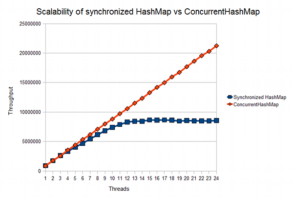

* [Коллекции](https://github.com/Home-GWT/TopLinkExample/blob/master/src/com/voituk/jpaexample/JPAExample.java#L517)
* [Обзор java.util.concurrent](https://habrahabr.ru/company/luxoft/blog/157273) **(** [SynchronizedMap, ConcurrentHashMap и многопоточность](http://creativeofdev.blogspot.com/2015/09/synchronizedmap-concurrenthashmap.html) **|** [Как работает ConcurrentHashMap](https://habrahabr.ru/post/132884) **|** [HashMap и ConcurrentHashMap популярные вопросы на собеседованиях](http://info.javarush.ru/translation/2013/09/23/HashMap-и-ConcurrentHashMap-популярные-вопросы-на-собеседованиях.html) **)**
---
     -- **Collection**:
        --- **List**: массив обвернутый в список (по индексу), двухсвязанный список (по итератору)
        --- **Set**: (множество) исключает дублирование элементов
        --- **Queue**: (LinkedQueue, ArrayDeque, PriorityQueue) одно-сторонние и двух-сторонние списки с приоритетами и блокировками
     -- **Map**: пара ключ-значение

***ArrayList*** — доступ к элементам выполняентся *по итератору* (быстрый поиск И быстрая вставка в конец списка за константное время)

***LinkedList*** — доступ к элементам выполняентся *по индексу* (быстрая вставка в конец списка за константное время И ~экономит размер списка | ~неэкономно, потому что заголовок тоже имеет размер)

***HashMap*** — хэш-таблицы (быстрый поиск И быстрая вставка в список И может работать с NULL)

***HashTable*** — хэш-таблицы (синхронизированный)

***TreeMap*** — само-сортирующие структуры (сортирует кастомерский-порядок элементов через Comparable)

***TreeSet*** — само-сортирующие структуры (создаёт коллекцию которая для хранения элементов применяет дерево. Объекты сохраняются в отсортированном порядке по возрастанию)

***LinkedHashMap*** — сортирует элементы по истории их добавления И работает быстрее за 'TreeMap'

***ConcurrentLinkedQueue*** — позволяет синхронно и очень быстро добавлять / удалять элементы в списке (используется очень быстр wait-free алгоритм для работы с garbage collector'ом...построен на CAS)

***ConcurrentHashMap*** — позволяет очень быстро и синхронно работать с хеш-таблицами

***ConcurrentLinkedDeque*** — поддерживает оба режима работы: FIFO (First In First Out) и LIFO (Last In First Out)

***BlockingQueue*** — возможностью задать размер очереди или с блокировками по условиям, при обработке больших потоков данных

---

***HashMap*** — это массив hash-bucket-ов, которые хранят в себе данные в структуре связанного списка.

***Synchronized Map*** — это потокобезопасная коллекция данных основанная на взаимоблокировках.

    Все методы синхронизированы, *HashTable* является разновидностью синхронизированной мапы.

***ConcurrentHashMap*** — это тот же *HashMap* но рассчитан для работы в многопоточной среде.

    В ConcurrentHashMap был введен новый слой абстракции, делиться на сегменты - по умолчанию 16 при инициализации.
    Именно сегменты нам позволяют использовать нашу Map-у, множеством потоков без блокирования всего объекта

---

* ConcurrentLinkedQueue:
.element()
.pull()
.peek()
.pop()

*Стек* - это структура данных, хранящая объекты в порядке "первым вошел, последним вышел" или "последним вошел, первым вышел".
       Обычно у этой структуры есть API с такими методами, как push() и pop(). Иногда присутствует метод peek().

***push()*** — метод принимает входной объект (например: foo и помещает его во внутренний контейнер; например: массив).
                Метод push() обычно ничего не возвращает.

Если передать методу push() два объекта, например, сначала foo, а потом bar - второй объект bar должен оказаться наверху концептуального стека, содержащего по крайней мере два объекта, так что при вызове метода pop() объект bar должен быть извлечен первым, до первого объекта foo. Если метод pop() вызвать еще раз, должен быть возвращен объект foo и стек должен стать пустым.

***pop()*** — метод удаляет самый последний элемент, добавленный в стек - да, метод pop() должен удалить верхний элемент, при этом предполагается, что в стеке есть элементы, чтобы их удалять.

***peek()*** — метод работает точно также (метод pop()), но при этом объект не удаляется.
               Метод peek() должен оставить верхний элемент в стеке.

Если вызвать метод pop(), когда в стек еще ничего не было добавлено -  метод pop() должен выдать исключение, показывающее, что в стек еще ничего не добавлялось.

Если выполнить команду push() null - стек должен выдать исключение, так как null не является допустимым значением для метода push().