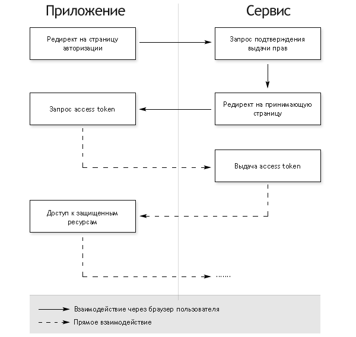

#[Аутентификация и авторизация в микросервисных приложениях](http://www.habrahabr.net/thread/2156)
* [habrahabr.net/thread/2156](http://www.habrahabr.net/thread/2156)
* `Регистрация`
* `Идентификация` — процесс **определения**, что за человек перед нами.
* `Аутентификация` — процесс **подтверждения**, что этот человек именно тот, за кого себя выдает.
* `Авторизация` — процесс **принятия решения** о том, что именно этой аутентифицированной персоне разрешается делать.

###HTTP Basic Authentication


###HTTP Digest Authentication


###Forms Authentication


###Token Authentication


#Single sign-on (SSO) — технология единого входа
* SSO — технология единого входа позволяет пользователю переключаться между различными приложениями без повторной аутентификации.
* `OpenID` — (протокол для ускоренной регистрации) для **проверки** учетных данных пользователя (Идентификация + Аутентификация).
* `OAuth` — (протокол для авторизованного доступа к стороннему API) открытый протокол авторизации который позволяет **предоставить** третьей стороне ограниченный доступ к защищённым ресурсам пользователя без необходимости передавать ей (третьей стороне) логин и пароль.
* `OpenID Connect` — (протокол) и то и другое одновременно (Идентификация + Аутентификация + Авторизация).
---
    (Милицейская аналогия)
        OAuth Consumer: Уголовный розыск.
        User: сотрудник Уголовного розыска.
        Service Provider: Картотека архива преступлений.
    Представьте что вы сотрудник Уголовного розыска, ищущий концы в деле о краже WebMoney за 1973-й год.
        OpenID: сотрудник Уголовного розыска (User) приходит в Картотеку (Service Provider), предъявляет на входе ксиву (Authorization) и на месте перебирает карточки в поисках информации.
        OAuth: сотрудник Уголовного розыска (User) прямо с работы (Consumer) звонит в Картотеку (Service Provider). Он докладывает свою фамилию; если его узнают (Authorization), он просит предоставить список всех преступлений за 1973-й год (API call).
    Как видите, OpenID и OAuth это разные вещи.
        OpenID — позволяет вам прямо на месте получить доступ к некоторым ресурсам.
        OAuth — обеспечивает получение части информации с удаленного сервиса через API.

###OAuth


###OpenID Connect
    OpenID Connect Provider — важнейший объект всего централизованного сервиса аутентификации, он выдает токены клиентам.
    Client — устройство или программа (браузер, приложение), которым требуется либо токен для аутентификации пользователя, либо токен для доступа к какому-то ресурсу (подразумевается что ресурс «знаком» с тем «OpenID Connect Provider» у которого клиент запрашивает токен для доступа).
    User — конечный пользователь (человек).
    Scope — идентификатор ресурса, к которому клиент хочет получить доступ. Они бывают двух видов:
        1. Identity scopes — это запрос информации о пользователе. Его имя, профиль, пол, фотография, адрес электронной почты и т. д.
        2. Resource scopes — имена внешних ресурсов (Web APIs), к которым клиент хочет получить доступ.
    Authentication/Token Request — процесс запроса аутентификации:
        1. Только Identity Token — если запрошены только Identity scopes.
        2. Identity Token и Access Token — если запрошены также и Resources scopes.
        3. Access Token и Refresh Token — если запрошeн Offline Access.

    Identity Token (Токен личности) — подтверждение аутентификации. Этот токен содержит минимальный набор информации о пользователе.
    Access Token (Токен доступа) — информация что конкретному пользователю разрешается делать (клиент запрашивает Access Token и затем использует его для доступа к ресурсам Web APIs).
    Refresh Token (Токен обновления) — токен по которому STS вернет новый Access Token (работа Refresh Token может быть многоразовым и одноразовым).


###Структура токена
    Основные поля:
    iss — адрес или имя удостоверяющего центра.
    sub — идентификатор пользователя. Уникальный в рамках удостоверяющего центра, как минимум.
    aud — имя клиента для которого токен выпущен.
    exp — срок действия токена.
    nbf — время, начиная с которого может быть использован (не раньше чем).
    iat — время выдачи токена.
    jti — уникальный идентификатор токен (нужен, чтобы нельзя был «выпустить» токен второй раз).


#OAuth
    OAuth2 — лучший кандидат в случаях когда доступ к вашим сервисам осуществляется через веб (для компьютеров использующих и Windows и Mac и UNIX-системы...)
    Существуют и другие, например:
        Kerberos — успешно взаимодействующий с Windows в случае гетерогенной сети...
* [ru.wikipedia.org/wiki/OAuth](https://ru.wikipedia.org/wiki/OAuth)
* [stackoverflow.com/questions/4113934/how-is-oauth-2-different-from-oauth-1](http://stackoverflow.com/questions/4113934/how-is-oauth-2-different-from-oauth-1)
* [geektimes.ru/post/77648](https://geektimes.ru/post/77648/)
* [habrahabr.ru/company/mailru/blog/115163](https://habrahabr.ru/company/mailru/blog/115163/)

###OAuth 1.0



###OAuth 2.0
    Ключевое отличие OAuth 2.0 от OAuth 1.0:
    + простота. В новой версии нет громоздких схем подписи, сокращено количество запросов, необходимых для авторизации (Этот вариант требует поднятия в приложении окна браузера, но не требует серверной части и дополнительного вызова сервер-сервер для обмена authorization code на access token).
    - Протокол OAuth 2.0 обратно не совместим с протоколом OAuth 1.0
    - OAuth 2.0 — развивающийся стандарт. Это значит, что спецификация еще не устоялась и постоянно меняется, иногда довольно заметно.


интеграция Identity Server в ваше приложение:
```javascript
public void Configuration(IAppBuilder app)
{
    var factory = new IdentityServerServiceFactory();
    factory.UseInMemoryClients(Clients.Get())
           .UseInMemoryScopes(Scopes.Get())
           .UseInMemoryUsers(Users.Get());

    var options = new IdentityServerOptions
    {
        SiteName = Constants.IdentityServerName,
        SigningCertificate = Certificate.Get(),
        Factory = factory,
    };

    app.UseIdentityServer(options);
}
```

интеграции веб-клиента с Identity Server:
```javascript
public void Configuration(IAppBuilder app)
{
    app.UseCookieAuthentication(new CookieAuthenticationOptions
    {
        AuthenticationType = "Cookies"
    });

    app.UseOpenIdConnectAuthentication(new OpenIdConnectAuthenticationOptions
    {
        ClientId = Constants.ClientName,
        Authority = Constants.IdentityServerAddress,
        RedirectUri = Constants.ClientReturnUrl,
        ResponseType = "id_token",
        Scope = "openid email",
        SignInAsAuthenticationType = "Cookies",
    });
}
```

интеграции веб-API с Identity Server:
```javascript
    public void Configuration(IAppBuilder app)
    {
        app.UseIdentityServerBearerTokenAuthentication(
            new IdentityServerBearerTokenAuthenticationOptions
            {
                Authority = Constants.IdentityServerAddress,
                RequiredScopes = new[] { "write" },
                ValidationMode = ValidationMode.Local,

                // credentials for the introspection endpoint
                ClientId = "write",
                ClientSecret = "secret"
            });

        app.UseWebApi(WebApiConfig.Register());
    }
```
